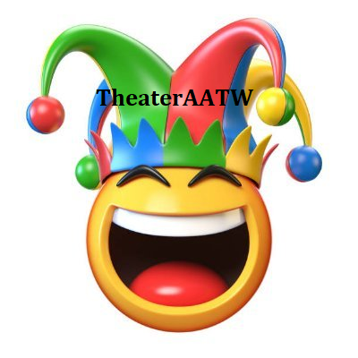
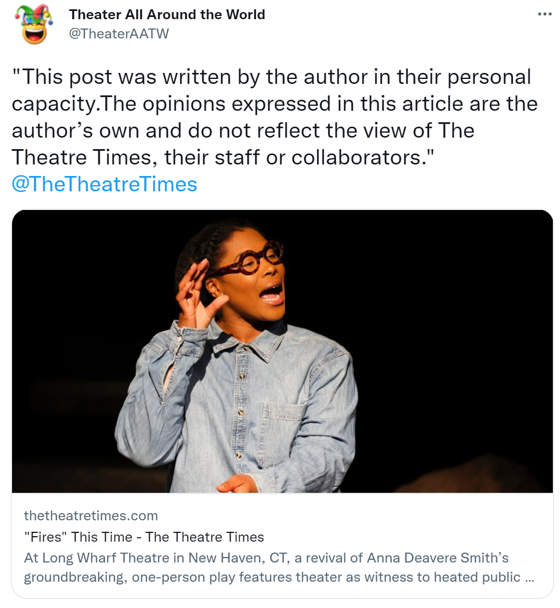

Theater All Around the World
========

A Twitter bot that posts scrapped text and links from specified theater websites on Twitter without the intervention of a human operator.

<p align="center">

</p>
<p align="center">

## Installation
  Before installation, `auth.py` should be filled and/or created with the Twitter API key and secret in the main folder. You can apply to Twitter developer account below:
  https://developer.twitter.com/
  
  ```bash
  # Clone the repositories
  git clone https://github.com/hozeren/theaterAATW.git
  
  # Go to the clone folder
  python setup.py install
  
  # or install with pip in the folder
  pip install .
  ```
## Usage
  There are two website functions now including [New York Times](https://www.nytimes.com/section/theater), [Whatsonstage](https://www.whatsonstage.com/news/?categories=theatre-news), [The Theatre Times](https://thetheatretimes.com/featured/), and [TheaterMania](https://www.theatermania.com/news/). To use the functions after installation;
  ```bash
usage: theateraatw [-h] [nytimes] [wostage] [tmania] [ttimes] [fav]

positional arguments:
  nytimes     Start scraping and sending tweets from New York Times.
  wostage     Start scraping and sending tweets from WhatsOnStage.
  tmania      Start scraping and sending tweets from TheaterMania.
  ttimes      Start scraping and sending tweets from The Theatre Times.
  fav         Favorite the tweets, use with following keywords.

optional arguments:
  -h, --help  show this help message and exit
  ```
## Tweet on Twitter
  
<p align="center">
<a href="https://twitter.com/TheaterAATW/status/1488766001269420034">
</p>
<p align="center">

### 📱 Latest Tweets

<!-- TWITTER:START -->
- [@TheaterAATW: &quot;The trilogy, ‘The Norman Conquests’ is a dark, realistic comedy.”&quot; @TheTheatreTimes](https://rss.app/articles/cb4e791f6f6d729c074351566bd3a7c508111d6e2b37b7e0d6e7953ba4b25088f10ba4482c9bc169f7ab6378de10079469dc6be6c71673168238)
- [@TheaterAATW: &quot;Original company member Anna Uzele will play her final performance as Catherine Parr on Sunday, March 13.&quot; @theatermania](https://rss.app/articles/cb4e791f6f6d729c074351566bd3a7c508111d6e2b37b7e0d6e7953ba4b25088f10ba4482c9bc169f7ab6378de17099460d56ee4c6117313893c)
- [@TheaterAATW: &quot;Tonight&#39;s the night!&quot; @WhatsOnStage](https://rss.app/articles/cb4e791f6f6d729c074351566bd3a7c508111d6e2b37b7e0d6e7953ba4b25088f10ba4482c9bc169f7ab6378de170a9663d76ee7c610721d8e3f)
- [@TheaterAATW: &quot;After a year’s absence because of the pandemic, this touring onstage celebration of the “Sesame Street” series has returned to the Hulu Theater at Madison Square Garden.&quot; @nytimestheater](https://rss.app/articles/cb4e791f6f6d729c074351566bd3a7c508111d6e2b37b7e0d6e7953ba4b25088f10ba4482c9bc169f7ab6378de170b9766d26be0c1117812883d)
- [@TheaterAATW: &quot;But not everyone is keen.&quot; @TheTheatreTimes](https://rss.app/articles/cb4e791f6f6d729c074351566bd3a7c508111d6e2b37b7e0d6e7953ba4b25088f10ba4482c9bc169f7ab6379d91d0a9467d36ee3c5167911883f)
<!-- TWITTER:END -->
